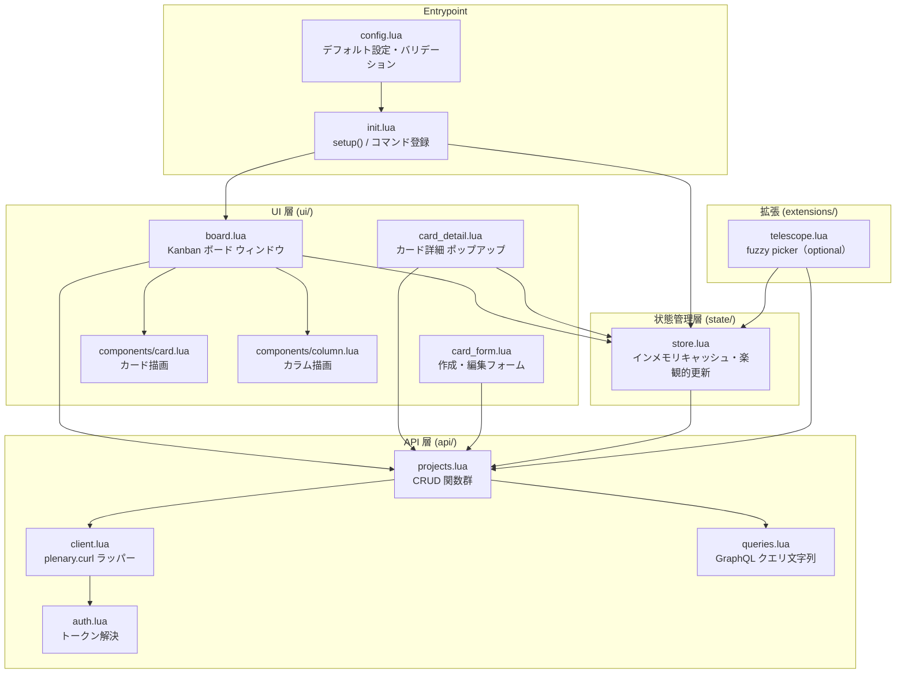

# 基本設計: gh-board.nvim

> 作成日: 2026-06-13

---

## アーキテクチャパターン

**レイヤードアーキテクチャ**を採用する。

- gh-board.nvim はサーバーサイドを持たない純クライアントプラグインで、ドメインの複雑さよりも「UI → 状態 → API → 認証」という明確な一方向フローが重要
- クリーンアーキテクチャは Neovim プラグインの規模では過剰であり、レイヤードで十分なテスタビリティが得られる

---

## レイヤー構成と依存方向



### 依存のルール

| ルール | 内容 |
|--------|------|
| 上位 → 下位のみ | UI → State → API の一方向。逆方向の依存禁止 |
| API 呼び出しは `api/` のみ | `ui/` や `state/` から GitHub API を直接呼ばない |
| `client.lua` 経由のみ | HTTP リクエストは必ず `api/client.lua` を通す |
| `config.lua` はどこからでも参照可 | 設定値は全レイヤーから読み取り可。書き込みは `setup()` 時のみ |

---

## ディレクトリ構成

```
gh-board.nvim/
├── lua/
│   └── gh_board/
│       ├── init.lua               -- setup() エントリポイント・コマンド登録
│       ├── config.lua             -- デフォルト設定・バリデーション
│       ├── api/
│       │   ├── auth.lua           -- トークン解決（gh CLI → env → config）
│       │   ├── client.lua         -- plenary.curl ラッパー・エラーハンドリング
│       │   ├── projects.lua       -- Project / Column / Card の CRUD
│       │   └── queries.lua        -- GraphQL クエリ文字列定数
│       ├── ui/
│       │   ├── board.lua          -- Kanban ボード フロートウィンドウ
│       │   ├── card_detail.lua    -- カード詳細ポップアップ
│       │   ├── card_form.lua      -- 作成・編集フォーム（nui.nvim）
│       │   └── components/
│       │       ├── card.lua       -- カード 1 行描画
│       │       └── column.lua     -- カラム描画
│       ├── state/
│       │   └── store.lua          -- インメモリ状態・楽観的更新
│       └── extensions/
│           └── telescope.lua      -- Telescope picker（optional）
├── plugin/
│   └── gh_board.lua               -- Neovim 起動時の autoload（コマンド定義）
├── doc/
│   └── gh-board.txt               -- Vimdoc ヘルプ
├── tests/
│   └── spec/
│       ├── api/
│       │   ├── auth_spec.lua
│       │   └── projects_spec.lua
│       └── state/
│           └── store_spec.lua
├── docs/                          -- 設計ドキュメント（プラグイン本体とは別）
├── .github/
│   └── workflows/
│       ├── ci.yml
│       └── release.yml
├── .stylua.toml
├── .luacheckrc
└── README.md
```

### 各モジュールの責務

| ファイル | 責務 |
|----------|------|
| `init.lua` | `setup(opts)` で設定を初期化し `:GhBoard` コマンドを登録する |
| `config.lua` | デフォルト値の定義と `setup()` オプションのマージ・バリデーション |
| `api/auth.lua` | `gh auth token` → `$GITHUB_TOKEN` → `config.token` の順でトークンを解決する |
| `api/client.lua` | `plenary.curl.post()` を薄くラップし、認証ヘッダー付与・エラー正規化を行う |
| `api/queries.lua` | GraphQL クエリ・ミューテーションの文字列定数を管理する |
| `api/projects.lua` | `list_projects` / `get_board` / `create_card` / `update_card` / `move_card` / `delete_card` の 6 関数を提供する |
| `state/store.lua` | プロジェクト・カラム・カードのインメモリキャッシュと楽観的更新・ロールバックを管理する |
| `ui/board.lua` | Kanban ボードのフロートウィンドウを描画し、キーマップを設定する |
| `ui/card_detail.lua` | カード詳細のポップアップを描画する |
| `ui/card_form.lua` | 新規作成・編集フォームを nui.nvim で構築する |
| `ui/components/card.lua` | カード 1 件分の表示テキストを生成する純粋関数 |
| `ui/components/column.lua` | カラム 1 列分の表示テキストを生成する純粋関数 |
| `extensions/telescope.lua` | Telescope の picker を登録し、カード一覧を fuzzy 検索できるようにする |
| `plugin/gh_board.lua` | Neovim 起動時に `require("gh_board")` を呼び出す autoload エントリ |

---

## CI/CD 設計

### ブランチ戦略

**GitHub Flow** を採用する。

- `main` ブランチは常にリリース可能な状態を保つ
- 機能開発は `feature/xxx` ブランチで行い、PR を通じて `main` にマージする
- リリースは `v*` タグ push でトリガーする

### PR チェック（`ci.yml`）

```
push / pull_request → main
  1. stylua --check lua/          # フォーマット確認
  2. luacheck lua/                # 静的解析
  3. nvim --headless              # ユニットテスト（plenary busted）
     -c "PlenaryBustedDirectory tests/ { minimal_init = 'tests/minimal_init.lua' }"
```

### リリースフロー（`release.yml`）

```
push → tags: v*
  1. CI チェック（上記と同じ）
  2. GitHub Release を自動作成（タグとコミットメッセージから生成）
```

luarocks への公開は v0.1.0 スコープ外。
