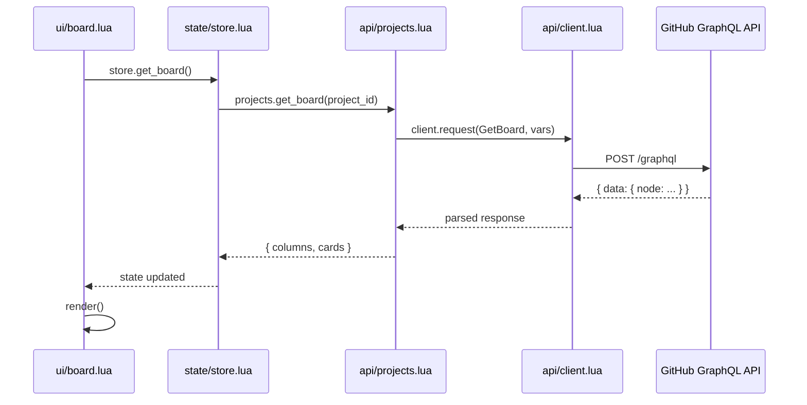
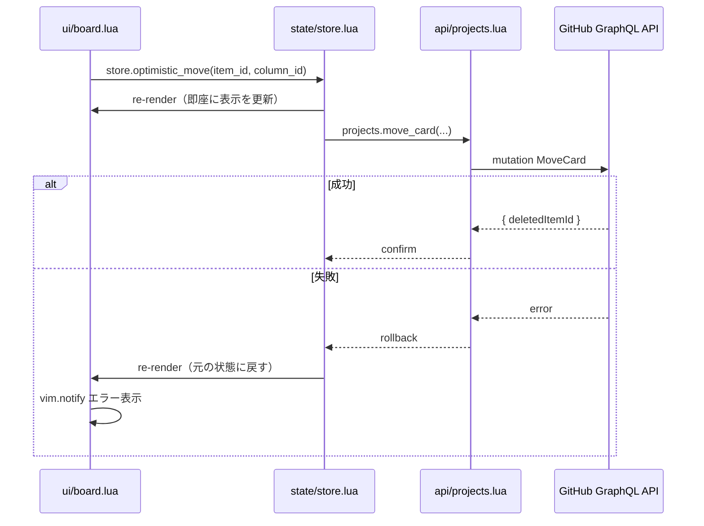
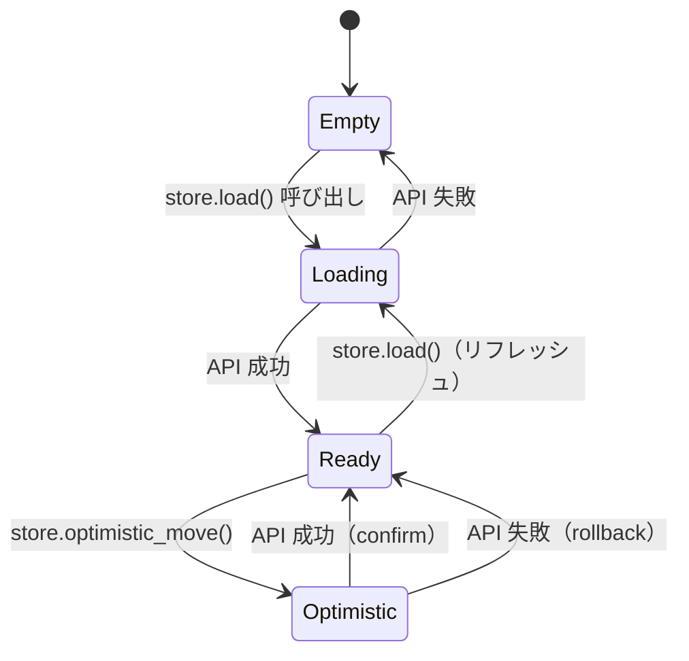

# 詳細設計: gh-board.nvim

> 作成日: 2026-06-13

---

## 1. GraphQL API 設計

GitHub Projects v2 は GraphQL API 専用。すべての操作を以下のクエリ・ミューテーションで実現する。

### 1-1. プロジェクト一覧取得

```graphql
query ListProjects($login: String!, $first: Int!) {
  user(login: $login) {
    projectsV2(first: $first) {
      nodes {
        id
        number
        title
        url
        closed
      }
    }
  }
}
```

| 引数 | 型 | 内容 |
|------|----|------|
| `$login` | `String!` | GitHub ユーザー名 |
| `$first` | `Int!` | 取得件数（上限: 20） |

**レスポンス → `GhProject[]`**

---

### 1-2. ボード取得（カラム + カード）

```graphql
query GetBoard($projectId: ID!, $first: Int!) {
  node(id: $projectId) {
    ... on ProjectV2 {
      id
      title
      fields(first: 20) {
        nodes {
          ... on ProjectV2SingleSelectField {
            id
            name
            options {
              id
              name
              color
            }
          }
        }
      }
      items(first: $first) {
        nodes {
          id
          fieldValues(first: 10) {
            nodes {
              ... on ProjectV2ItemFieldSingleSelectValue {
                optionId
                field {
                  ... on ProjectV2SingleSelectField {
                    id
                    name
                  }
                }
              }
            }
          }
          content {
            ... on DraftIssue {
              id
              title
              body
              assignees(first: 5) {
                nodes { login }
              }
            }
            ... on Issue {
              id
              number
              title
              body
              state
              url
              assignees(first: 5) {
                nodes { login }
              }
              labels(first: 10) {
                nodes { name color }
              }
              createdAt
              updatedAt
            }
            ... on PullRequest {
              id
              number
              title
              body
              state
              url
              assignees(first: 5) {
                nodes { login }
              }
              labels(first: 10) {
                nodes { name color }
              }
              createdAt
              updatedAt
            }
          }
        }
      }
    }
  }
}
```

| 引数 | 型 | 内容 |
|------|----|------|
| `$projectId` | `ID!` | プロジェクトの GraphQL node ID |
| `$first` | `Int!` | カード取得件数（上限: 100） |

**レスポンス → `{ columns: GhColumn[], cards: GhCard[] }`**

---

### 1-3. カード作成（Draft Issue）

```graphql
mutation CreateCard($projectId: ID!, $title: String!, $body: String) {
  addProjectV2DraftIssue(input: {
    projectId: $projectId
    title: $title
    body: $body
  }) {
    projectItem {
      id
    }
  }
}
```

**レスポンス → `{ id: string }`**

---

### 1-4. カード更新（Draft Issue）

```graphql
mutation UpdateDraftIssue($draftIssueId: ID!, $title: String!, $body: String) {
  updateProjectV2DraftIssue(input: {
    draftIssueId: $draftIssueId
    title: $title
    body: $body
  }) {
    draftIssue {
      id
      title
      body
    }
  }
}
```

---

### 1-5. カード更新（Issue / PR）

```graphql
mutation UpdateIssue($issueId: ID!, $title: String!, $body: String) {
  updateIssue(input: {
    id: $issueId
    title: $title
    body: $body
  }) {
    issue {
      id
      title
      body
    }
  }
}
```

---

### 1-6. ステータス変更（カラム移動）

```graphql
mutation MoveCard(
  $projectId: ID!
  $itemId: ID!
  $fieldId: ID!
  $optionId: String!
) {
  updateProjectV2ItemFieldValue(input: {
    projectId: $projectId
    itemId: $itemId
    fieldId: $fieldId
    value: { singleSelectOptionId: $optionId }
  }) {
    projectV2Item {
      id
    }
  }
}
```

| 引数 | 内容 |
|------|------|
| `$fieldId` | Status フィールドの node ID |
| `$optionId` | 移動先カラムの option ID（`GhColumn.id`） |

---

### 1-7. カード削除

```graphql
mutation DeleteCard($projectId: ID!, $itemId: ID!) {
  deleteProjectV2Item(input: {
    projectId: $projectId
    itemId: $itemId
  }) {
    deletedItemId
  }
}
```

---

### API シーケンス図

#### ボード表示



#### カードのステータス変更（楽観的更新）



---

## 2. データモデル（Lua 型定義）

`api/projects.lua` が返す Lua テーブルの型。LuaLS アノテーションで記述する。

```lua
---@class GhProject
---@field id string          GraphQL node ID（"PVT_xxx"）
---@field number integer     プロジェクト番号
---@field title string
---@field url string
---@field closed boolean

---@class GhColumn
---@field id string          SingleSelectField の option ID
---@field field_id string    Status フィールドの node ID（move_card に必要）
---@field name string        表示名（例: "Todo", "In Progress"）
---@field color string       GitHub のカラーラベル（例: "GREEN"）

---@class GhCardContent
---@field id string          Draft Issue ID または Issue/PR node ID
---@field kind "draft"|"issue"|"pr"
---@field number integer|nil  Issue/PR 番号（Draft の場合 nil）
---@field title string
---@field body string
---@field state string|nil   "OPEN" | "CLOSED" | "MERGED"（Issue/PR のみ）
---@field url string|nil     Issue/PR URL（Draft の場合 nil）
---@field assignees string[] ログイン名の配列
---@field labels { name: string, color: string }[]
---@field created_at string  ISO 8601
---@field updated_at string  ISO 8601

---@class GhCard
---@field id string          ProjectItem node ID（"PVTI_xxx"）
---@field column_id string   現在の column（option）ID
---@field content GhCardContent

---@class BoardState
---@field project GhProject
---@field columns GhColumn[]
---@field cards GhCard[]
---@field status_field_id string  Status フィールドの node ID（move_card 用）
```

---

## 3. 状態管理設計（store.lua）

### 状態構造

```lua
-- store.lua の内部状態（モジュールローカル変数）
local M = {}

---@type BoardState|nil
local _state = nil

---@type BoardState|nil  楽観的更新前のスナップショット
local _snapshot = nil
```

### 公開 API

| 関数 | シグネチャ | 説明 |
|------|-----------|------|
| `load` | `(project_id: string, cb: fun(err?))` | API からボードを取得して `_state` を更新する |
| `get_state` | `() -> BoardState?` | 現在の状態を返す |
| `optimistic_move` | `(item_id, column_id, on_revert: fun())` | 楽観的に `_state` を更新し API 呼び出し。失敗時に `on_revert` を呼ぶ |
| `apply_create` | `(card: GhCard)` | 作成成功後に `_state.cards` へ追加する |
| `apply_update` | `(card: GhCard)` | 更新成功後に `_state.cards` を差し替える |
| `apply_delete` | `(item_id: string)` | 削除成功後に `_state.cards` から除去する |

### 状態更新フロー



### 楽観的更新の詳細

1. `_snapshot = deep_copy(_state)` で現在の状態を保存
2. `_state.cards` の該当カードの `column_id` を即座に書き換え
3. UI の `on_update` コールバックを呼び出して再描画
4. バックグラウンドで `projects.move_card()` を実行
5. 成功 → `_snapshot = nil`
6. 失敗 → `_state = _snapshot` に戻して再描画 + `vim.notify` エラー
