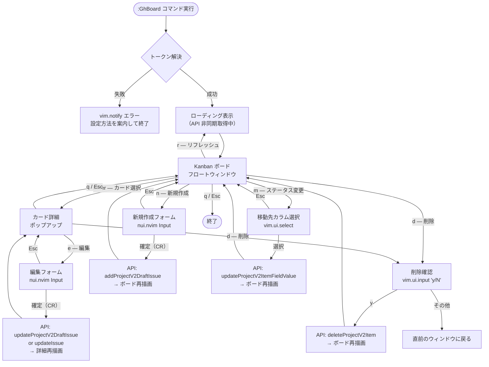

# UX フロー設計: gh-board.nvim

> 作成日: 2026-06-13

---

## ウィンドウ遷移図



---

## キーマップ一覧

### Kanban ボード（board.lua）

| キー | 操作 |
|------|------|
| `<Enter>` | カーソル位置のカードを詳細表示 |
| `n` | 新規カード作成フォームを開く |
| `m` | カードのステータス変更（移動先カラム選択） |
| `d` | カードの削除確認ダイアログ |
| `r` | ボードをリフレッシュ（API 再取得） |
| `q` / `<Esc>` | ボードを閉じる |
| `j` / `k` | カーソル移動（下 / 上） |
| `h` / `l` | カラム移動（左 / 右） |

### カード詳細（card_detail.lua）

| キー | 操作 |
|------|------|
| `e` | 編集フォームを開く |
| `d` | 削除確認ダイアログ |
| `q` / `<Esc>` | 詳細を閉じてボードに戻る |

### 新規作成・編集フォーム（card_form.lua）

| キー | 操作 |
|------|------|
| `<CR>`（Insert モード外） | 確定して API 実行 |
| `<Esc>` | キャンセルして前の画面に戻る |

---

## ウィンドウレイアウト（概念図）

### Kanban ボード

```
┌─────────────────────────────────────────────────────────────┐
│  gh-board: MyProject                              [r]efresh  │
├──────────────┬──────────────┬──────────────┬────────────────┤
│  Todo (3)    │ In Progress  │   In Review  │   Done (12)    │
│──────────────│──────────────│──────────────│────────────────│
│ ▶ Fix login  │ ▶ Add OAuth  │ ▶ Refactor   │   Deploy CI    │
│   bug        │   support    │   DB layer   │   Update docs  │
│   Add tests  │              │              │   ...          │
│   ...        │              │              │                │
└──────────────┴──────────────┴──────────────┴────────────────┘
```

### カード詳細ポップアップ

```
┌──────────────────────────────────────────┐
│  Fix login bug                    [e]dit │
│──────────────────────────────────────────│
│  Status   : Todo                         │
│  Assignee : @koushina47                  │
│  Labels   : bug, high-priority           │
│  Created  : 2026-06-10                   │
│  Updated  : 2026-06-12                   │
│──────────────────────────────────────────│
│  Description                             │
│  ログインフォームの送信後に 500 エラーが │
│  発生する。セッション周りの問題と思われ  │
│  る。                                    │
│──────────────────────────────────────────│
│  Linked Issue: #42 Fix auth middleware   │
│                (open)                    │
│──────────────────────────────────────────│
│  [e]dit  [d]elete  [q]close              │
└──────────────────────────────────────────┘
```
