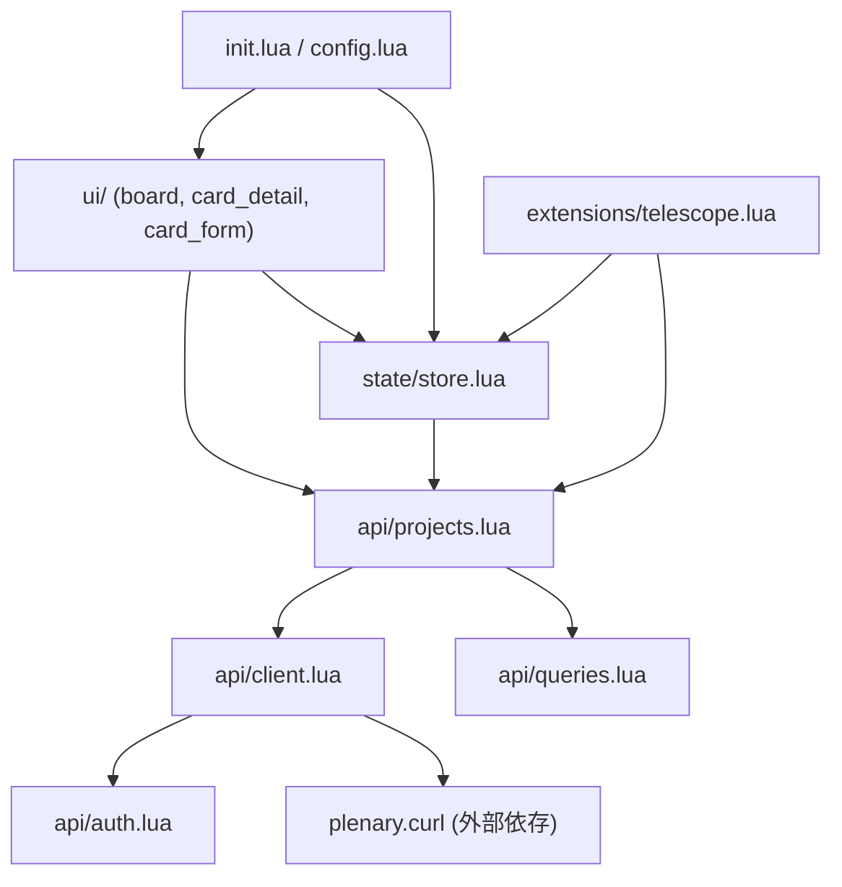

# PLAN: gh-board.nvim

> 作成日: 2026-06-13
> ステータス: 実装完了（v0.1.0 リリース待ち）

## エグゼクティブサマリー

> **目的**: Neovim のフロートウィンドウで GitHub Projects v2 の Kanban ボードを表示・操作し、ブラウザ切り替えコストをゼロにする
> **期待される成果**: nvim から `:GhBoard` コマンド一発で Kanban を開き、カードの閲覧・作成・編集・ステータス変更・削除・コメントをすべて nvim 内で完結できる Lua プラグイン
> **完了条件**: 必須機能 4 件が実装済みかつ GitHub Projects v2 との双方向同期が動作すること

---

## 1. 背景・目的

### 指示（原文）
> nvimのプラグインを作成したいです。github projects の kanban を nvim のフロートウィンドウにレンダリングして、一覧表示、閲覧、編集などそのほかにも必要な機能も含めて作成したいです。また、編集した内容などは github projects の kanban の内容と同期できるようにしたいです

### ヒアリング結果

| 項目 | 回答 |
|------|------|
| 解決する課題 | ブラウザ切り替えコストを減らしたい |
| 必須機能 | Kanban 一覧表示 / カード詳細表示 / カードのステータス変更 / カードの新規作成・編集・削除 |
| Nice to Have | コメントの投稿・編集 / Issue・PR リンク表示 / 複数プロジェクト切り替え / Telescope 統合 |
| 認証方式 | 複数対応（gh CLI トークン → 環境変数 → setup オプション のフォールバック） |
| サーバーサイド | なし（純クライアントプラグイン） |

### 目的の深掘り

- **解決する課題**: GitHub Projects をブラウザで開く → nvim に戻る の往復がコンテキストスイッチを生んでいる。nvim 内で完結させることで開発フローを断絶させない
- **ターゲットユーザー**: nvim をメインエディタとして使用し、GitHub Projects v2 でタスク管理をしているエンジニア
- **成功の定義**: ブラウザを一度も開かずに、Kanban の読み書き操作が nvim 内で完結できること

---

## 2. 技術スタック（概要）

| レイヤー | 採用技術 | 選定理由（詳細は docs/decisions/ 参照） |
|----------|----------|----------------------------------------|
| プラグイン言語 | Lua | Neovim プラグインの標準言語。高速でランタイム不要 |
| GitHub API | GraphQL v4 | Projects v2 は GraphQL 専用 API（REST では操作不可） |
| HTTP クライアント | plenary.nvim `curl` | Neovim エコシステムで最も広く使われる非同期 HTTP ラッパー |
| UI コンポーネント | nui.nvim | フロートウィンドウ・ポップアップ・入力フォームの実績あるライブラリ |
| 認証 | gh CLI / GITHUB_TOKEN / setup option | フォールバックチェーンで環境を選ばない |
| テスト | plenary.nvim busted | Lua 向け BDD テストフレームワーク |
| (Optional) 検索 | telescope.nvim | Neovim 向け fuzzy finder の事実上の標準 |

---

## 3. タスク一覧

### Phase 0: 企画・要件定義

- [x] **docs/concept.md 作成** — 目的・ターゲット・成功指標を記述
- [x] **docs/requirements.md 作成** — USDM 形式で機能要件・非機能要件・スコープ外を定義

<details>
<summary>要件定義 概要（USDM 形式で docs/requirements.md に展開）</summary>

**R-01 Kanban ボード表示**
- S01: `:GhBoard` コマンドでフロートウィンドウを開く
- S02: 設定済みプロジェクトのカラム（ステータス列）とカード一覧を表示する
- S03: カラムは横並びで表示し、各カラム内にカード名を縦に列挙する
- S04: データ取得中はローディングインジケーターを表示する

**R-02 カード詳細表示**
- S01: カードを選択（Enter）すると詳細ウィンドウをポップアップ表示する
- S02: タイトル・本文・担当者・ラベル・作成日・更新日を表示する
- S03: リンクされた Issue / PR の番号・タイトルを表示する（NF との兼ね合い）

**R-03 カードのステータス変更**
- S01: ボード上でカードを選択し `m`（move）キーで移動先カラムを選択できる
- S02: 選択後 GitHub API へ mutation を送り、成功したらボードを再描画する
- S03: API エラー時はエラーメッセージを通知し、状態をロールバックする

**R-04 カードの新規作成**
- S01: `n` キーで新規作成フォームを開く
- S02: タイトル（必須）・本文（任意）を入力できる
- S03: 確定すると Draft Issue として当該プロジェクトに追加し、ボードに反映する

**R-05 カードの編集**
- S01: 詳細ウィンドウで `e` キーを押すと編集モードになる
- S02: タイトル・本文を編集できる
- S03: 保存（`:w` または `<CR>`）で API mutation を実行し同期する

**R-06 カードの削除**
- S01: ボードまたは詳細ウィンドウで `d` キーで削除確認ダイアログを表示する
- S02: 確認後 API mutation を実行しボードから除去する

**R-07 認証**
- S01: `gh auth token` コマンドでトークンを取得する（最優先）
- S02: `$GITHUB_TOKEN` 環境変数をフォールバック
- S03: `setup({ token = "..." })` オプションをフォールバック
- S04: いずれも取得できない場合は設定方法のエラーメッセージを表示する

**NF-01 パフォーマンス**
- S01: Kanban 初期表示は API レスポンス受信後 200ms 以内に描画完了する
- S02: API 呼び出しは非同期（vim.fn.jobstart or luv）で行い nvim の UI をブロックしない

**スコープ外**
- GitHub Projects v1（クラシック）のサポート
- Issue / PR 自体の作成・マージ（Projects 上のカード操作のみ）
- リアルタイムポーリング（手動リフレッシュ `r` キーで対応）

</details>

---

### Phase 1: 基本設計

- [x] **ソフトウェアアーキテクチャ設計** — レイヤー構成と依存方向を Mermaid で図示（`docs/design/basic-design.md`）
- [x] **ディレクトリ構成設計** — lua/ 以下のモジュール責務を定義
- [x] **UI フロー設計** — ウィンドウ遷移・キーマップを Mermaid で図示（`docs/design/ux-flow.md`）
- [x] **CI/CD 設計** — lint・test・リリースフロー（GitHub Actions）

<details>
<summary>ディレクトリ構成（案）</summary>

```
gh-board.nvim/
├── lua/
│   └── gh_board/
│       ├── init.lua             -- setup() エントリポイント・コマンド登録
│       ├── config.lua           -- デフォルト設定・バリデーション
│       ├── api/
│       │   ├── client.lua       -- plenary.curl ラッパー（全 API 呼び出しはここ経由）
│       │   ├── auth.lua         -- トークン解決（gh CLI → env → config）
│       │   ├── projects.lua     -- Project / Column / Card の CRUD
│       │   └── queries.lua      -- GraphQL クエリ文字列定数
│       ├── ui/
│       │   ├── board.lua        -- Kanban ボード フロートウィンドウ
│       │   ├── card_detail.lua  -- カード詳細 ポップアップ
│       │   ├── card_form.lua    -- 作成・編集フォーム
│       │   └── components/
│       │       ├── column.lua   -- カラムコンポーネント描画
│       │       └── card.lua     -- カードコンポーネント描画
│       ├── state/
│       │   └── store.lua        -- インメモリ状態（projects・columns・cards）
│       └── extensions/
│           └── telescope.lua    -- Telescope picker（optional）
├── plugin/
│   └── gh_board.lua             -- VimL autoload: コマンド定義
├── doc/
│   └── gh-board.txt             -- Vimdoc ヘルプ
└── tests/
    └── spec/
        ├── api/
        │   ├── auth_spec.lua
        │   └── projects_spec.lua
        └── state/
            └── store_spec.lua
```

</details>

<details>
<summary>アーキテクチャ（レイヤー依存方向）</summary>



</details>

<details>
<summary>UI フロー（ウィンドウ遷移）</summary>

```mermaid
flowchart TD
  Start([":GhBoard コマンド"]) --> Auth{認証チェック}
  Auth -->|失敗| ErrMsg["エラー通知\n設定方法を案内"]
  Auth -->|成功| Fetch["API: プロジェクト一覧取得"]
  Fetch --> Board["Kanban ボード\nフロートウィンドウ"]

  Board -->|Enter| Detail["カード詳細\nポップアップ"]
  Board -->|n| NewForm["新規作成フォーム"]
  Board -->|m| MoveMenu["移動先カラム選択"]
  Board -->|d| DelConfirm["削除確認ダイアログ"]
  Board -->|r| Fetch
  Board -->|q / Esc| Close(["閉じる"])

  Detail -->|e| EditForm["編集フォーム"]
  Detail -->|d| DelConfirm
  Detail -->|q| Board

  NewForm -->|:w / CR| "API: カード作成 → ボード再描画"
  EditForm -->|:w / CR| "API: カード更新 → 詳細再描画"
  MoveMenu -->|Enter| "API: ステータス変更 → ボード再描画"
  DelConfirm -->|y| "API: カード削除 → ボード再描画"
```

</details>

---

### Phase 2: 詳細設計

- [x] **GraphQL API 設計** — 使用するクエリ・ミューテーションの入出力型を定義（`docs/design/detailed-design.md`）
- [x] **データモデル設計** — Lua 側の型定義（Project / Column / Card / Comment）
- [x] **状態管理設計** — store.lua の構造・更新フロー

<details>
<summary>GraphQL 操作一覧（案）</summary>

| 操作 | GraphQL 種別 | 用途 |
|------|-------------|------|
| `viewer { projectsV2 }` | query | ユーザーのプロジェクト一覧取得 |
| `organization { projectsV2 }` | query | Org のプロジェクト一覧取得 |
| `node(id) { ...ProjectV2 { items } }` | query | ボードのカラム・カード取得 |
| `addProjectV2DraftIssue` | mutation | 新規 Draft Issue カード作成 |
| `updateProjectV2ItemFieldValue` | mutation | ステータス（カラム）変更 |
| `updateProjectV2DraftIssue` | mutation | タイトル・本文編集 |
| `deleteProjectV2Item` | mutation | カード削除 |
| `addComment` | mutation | コメント投稿（Nice to Have） |

</details>

<details>
<summary>Lua データモデル（案）</summary>

```lua
-- types (Lua table conventions)

---@class GhProject
---@field id string  -- GraphQL node ID
---@field number integer
---@field title string
---@field url string

---@class GhColumn
---@field id string
---@field name string  -- ステータス名 (e.g. "Todo", "In Progress", "Done")
---@field color string

---@class GhCard
---@field id string     -- ProjectItem node ID
---@field title string
---@field body string
---@field column_id string
---@field assignees string[]
---@field labels string[]
---@field linked_issue { number: integer, url: string } | nil
---@field created_at string
---@field updated_at string
```

</details>

---

### Phase 3: 技術選定

- [x] **ADR-001**: HTTP クライアント選定（plenary.curl vs vim.fn.jobstart + curl）
- [x] **ADR-002**: UI ライブラリ選定（nui.nvim vs 自前フロートウィンドウ）
- [x] **ADR-003**: テストフレームワーク選定（plenary busted vs vusted）
- [x] **ADR-004**: GitHub Projects v2 API アプローチ（GraphQL のみ使用、REST は除外を確認）

---

### Phase 4: 開発環境構築

- [x] **stylua 設定** — `.stylua.toml`（Lua フォーマッター）
- [x] **luacheck 設定** — `.luacheckrc`（静的解析）
- [x] **CI パイプライン実装** — `.github/workflows/ci.yml`（lint + test on push/PR）
- [x] **リリース CI 実装** — `.github/workflows/release.yml`（タグ push → GitHub Release）
- [x] **pre-commit フック** — stylua 自動フォーマット

<details>
<summary>CI 設計（GitHub Actions）</summary>

**ブランチ戦略**: GitHub Flow（main ブランチ + feature ブランチ）

**PR チェック (`ci.yml`)**:
1. `stylua --check` — フォーマット確認
2. `luacheck lua/` — 静的解析
3. `nvim --headless -c "PlenaryBustedDirectory tests/"` — ユニットテスト

**リリーストリガー (`release.yml`)**:
- `v*` タグ push → GitHub Release 自動作成
- `luarocks upload`（将来的に luarocks 公開する場合）

</details>

---

### Phase 5: 実装

実装順序はアーキテクチャの依存方向に従う（下位レイヤーから上位へ）。

#### 5-1. 基盤層

- [x] `lua/gh_board/config.lua` — デフォルト設定・`setup()` オプション定義
- [x] `lua/gh_board/api/auth.lua` — トークン解決（gh CLI → env → config）
- [x] `lua/gh_board/api/queries.lua` — GraphQL クエリ文字列定数
- [x] `lua/gh_board/api/client.lua` — plenary.curl ラッパー・エラーハンドリング

#### 5-2. API 層

- [x] `lua/gh_board/api/projects.lua`
  - [x] `list_projects(owner)` — プロジェクト一覧
  - [x] `get_board(project_id)` — カラム + カード取得
  - [x] `create_card(project_id, title, body)` — Draft Issue 作成
  - [x] `update_card(item_id, title, body)` — タイトル・本文更新
  - [x] `move_card(item_id, field_id, option_id)` — ステータス変更
  - [x] `delete_card(item_id)` — カード削除

#### 5-3. 状態管理層

- [x] `lua/gh_board/state/store.lua`
  - [x] プロジェクト・カラム・カードのインメモリキャッシュ
  - [x] `refresh()` — API から再取得して状態更新
  - [x] `optimistic_move(item_id, column_id)` — 楽観的 UI 更新

#### 5-4. UI 層

- [x] `lua/gh_board/ui/components/card.lua` — カードの 1 行テキスト描画
- [x] `lua/gh_board/ui/components/column.lua` — カラムのタイトル + カード一覧描画
- [x] `lua/gh_board/ui/board.lua` — Kanban ボード フロートウィンドウ + キーマップ
- [x] `lua/gh_board/ui/card_detail.lua` — カード詳細ポップアップ
- [x] `lua/gh_board/ui/card_form.lua` — 作成・編集フォーム（nui Input / Popup）

#### 5-5. エントリポイント

- [x] `lua/gh_board/init.lua` — `setup()` + `:GhBoard` コマンド登録
- [x] `plugin/gh_board.lua` — Neovim 起動時の autoload

#### 5-6. ヘルプ

- [x] `doc/gh-board.txt` — Vimdoc ヘルプ（`:help gh-board`）

#### 5-7. Nice to Have

- [ ] `lua/gh_board/api/projects.lua` — `post_comment()` / `update_comment()`
- [ ] `lua/gh_board/ui/card_detail.lua` — コメント表示・投稿 UI
- [ ] `lua/gh_board/extensions/telescope.lua` — Telescope picker 統合
- [ ] 複数プロジェクト切り替え UI（ボード上で `<Tab>` or `:GhBoard <owner/repo>`）

---

### Phase 6: テスト・品質確認

- [x] **単体テスト**: `tests/spec/api/auth_spec.lua`（トークン解決ロジック）
- [x] **単体テスト**: `tests/spec/api/projects_spec.lua`（GraphQL レスポンスのパース）
- [x] **単体テスト**: `tests/spec/state/store_spec.lua`（楽観的更新・ロールバック）
- [ ] **手動動作確認**: 必須機能 R-01〜R-07 を GitHub 上の実プロジェクトで確認
- [x] **stylua + luacheck** — CI グリーン確認（ローカル未インストール、CI で確認）
- [ ] **エラーケース確認**: 認証失敗・API エラー・ネットワーク断（実 GitHub Projects での手動確認が必要）

---

### Phase 7: リリース準備

- [x] **バージョニング** — `Cargo.toml` 等なし。`CHANGELOG.md` + git タグ `v0.1.0`
- [x] **CHANGELOG.md** — v0.1.0 リリースノート記載
- [x] **README.md** — インストール方法（lazy.nvim / packer）・設定例・キーマップ一覧
- [ ] **GitHub Release** — タグ push で CI が自動作成することを確認（手動: `git tag v0.1.0 && git push origin v0.1.0`）

---

### 120%タスク（Nice to Have）

- [ ] コメントの投稿・編集（`lua/gh_board/api/projects.lua` + 詳細 UI 拡張）
- [ ] Issue / PR リンク表示（カード詳細に番号・タイトル・状態を表示）
- [ ] 複数プロジェクト切り替え（プロジェクト選択 UI、`:GhBoard <owner>/<number>`）
- [ ] Telescope 統合（`telescope.load_extension("gh_board")` でカード fuzzy 検索）
- [ ] ローカルキャッシュ（`vim.fn.stdpath("cache")` に JSON キャッシュ → 起動を高速化）
- [ ] Org プロジェクトサポート（`organization { projectsV2 }` クエリ追加）

---

## 4. リスク・懸念点

| リスク | 影響 | 対策 |
|--------|------|------|
| GitHub Projects v2 は GraphQL 専用。REST API では操作不可 | 高 | GraphQL のみで実装。plenary.curl で POST リクエスト送信 |
| nui.nvim の API が破壊的変更される可能性 | 中 | バージョンをピン留め（lazy.nvim の `tag` / `commit`）する |
| plenary.nvim が必須依存になる | 低 | 広く使われており受け入れコストは低い。将来的に luv 直接呼び出しへ移行可能 |
| GitHub API レート制限（認証済み 5000 req/h） | 低 | キャッシュ + 手動リフレッシュで過剰リクエストを防ぐ |
| Windows / WSL 環境で gh CLI のパスが異なる | 中 | `vim.fn.exepath("gh")` でパス解決。見つからない場合は次のフォールバックへ |

---

## 5. 確認事項

- [x] GitHub Projects v2 の API（GraphQL）でドラフト Issue 以外のカード（Issue/PR を紐付けたカード）の本文編集は `updateProjectV2DraftIssue` ではなく `updateIssue` ミューテーションになる。スコープに含めるか？
  - スコープに含める
- [x] カラムの順序はユーザーが GitHub 上でカスタマイズしていることがある。API から取得した順序をそのまま表示するか、固定順序にするか？
  - 取得した順序をそのまま表示する
- [x] luarocks への公開は v0.1.0 のスコープに含めるか？
  - 必要ない

---

## 6. スケジュール

| フェーズ | 目安 |
|----------|------|
| Phase 0–3（設計） | 1〜2 日 |
| Phase 4（環境構築） | 0.5 日 |
| Phase 5-1〜5-3（基盤 + API + 状態） | 2〜3 日 |
| Phase 5-4〜5-5（UI + エントリポイント） | 3〜4 日 |
| Phase 6（テスト・品質） | 1〜2 日 |
| Phase 7（リリース準備） | 0.5 日 |
| **合計** | **8〜12 日** |

---

*この計画は Claude Code `/plan-app` により生成されました*
